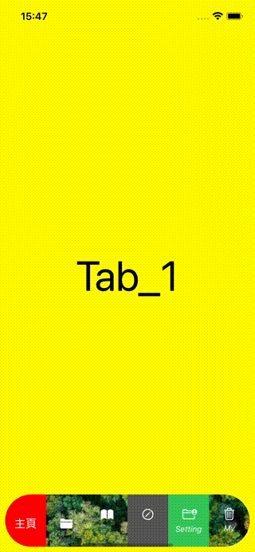
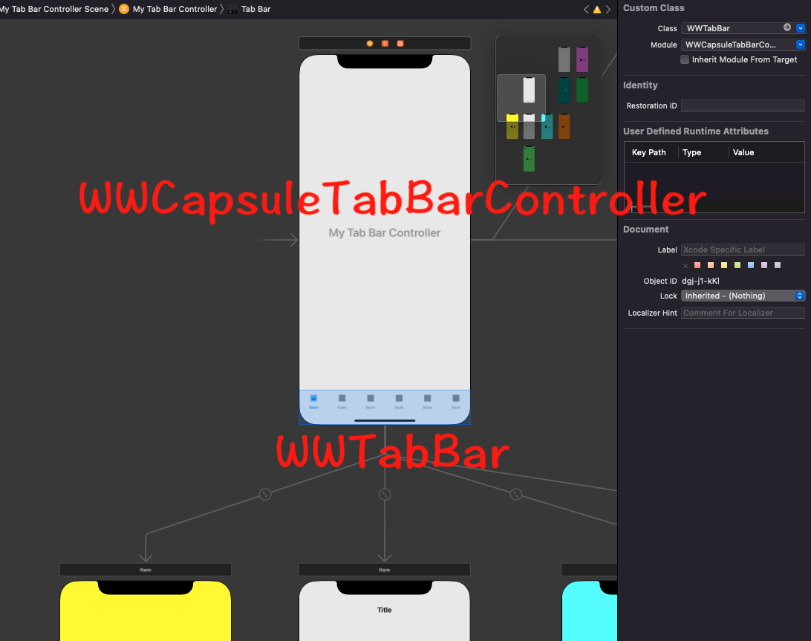

# WWCapsuleTabBarController
[](https://developer.apple.com/swift/) [](https://developer.apple.com/swift/)  [](https://developer.apple.com/swift/) [](https://developer.apple.com/swift/)

## [Introduction - 簡介](https://swiftpackageindex.com/William-Weng)
- Based on UITabBarController, implement a TabBarController that can display more than six Tabs.
- 基於UITabBarController，實現能顯示六個以上Tab的TabBarController。



### [Installation with Swift Package Manager](https://medium.com/彼得潘的-swift-ios-app-開發問題解答集/使用-spm-安裝第三方套件-xcode-11-新功能-2c4ffcf85b4b)
```js
dependencies: [
    .package(url: "https://github.com/William-Weng/WWCapsuleTabBarController.git", .upToNextMajor(from: "1.1.0"))
]
```

### WWCapsuleTabBarControllerDelegate

|函式|功能|
|-|-|
|didSelectedTab(_:withIndex:)|選到的分頁Tab的index|
|backgroundImages(_:withIndex:)|選到的分頁Tab的整體背景圖片|
|backgroundColors(_:withIndex:)|選到的分頁Tab的整體背景色|
|itemIcons(_:withIndex:)|分頁Item的圖示|
|itemBackgroundColors(_:withIndex:)|分頁Item的背景色|
|itemTitles(_:withIndex:)|分頁Item的文字|
|itemTitleColors(_:withIndex:)|分頁Item的文字顏色|
|itemTitleFonts(_:withIndex:)|分頁Item的文字字型|

### Function - 可用函式
|函式|功能|
|-|-|
|myDelegateSetting(_:)|設定WWCapsuleTabBarControllerDelegate|
|configure(withIndex:)|顏色 / 文字設定 for selectedIndex|
|hidden(_:duration:)|隱藏 / 顯示自訂TabBar|

### Setting - 相關設定


### Example - 範例
```swift
import UIKit
import WWCapsuleTabBarController
import WWPrint

final class MyTabBarController: WWCapsuleTabBarController {
    
    override func viewDidLoad() {
        super.viewDidLoad()
        initSetting()
    }
}

// MARK: - WWCapsuleTabBarControllerDelegate
extension MyTabBarController: WWCapsuleTabBarControllerDelegate {
    
    func didSelectedTab(_ tabBarController: WWCapsuleTabBarController, withIndex: Int) {
        wwPrint(index)
    }
    
    func backgroundImages(_ tabBarController: WWCapsuleTabBarController, withIndex index: Int) -> UIImage? {
        
        let images = [
            UIImage(named: "Green"),
            UIImage(named: "Yellow"),
            UIImage(named: "Blue"),
            UIImage(named: "Green"),
            UIImage(named: "Yellow"),
            UIImage(named: "Blue"),
        ]
        
        return images[safe: index] ?? nil
    }
    
    func backgroundColors(_ tabBarController: WWCapsuleTabBarController, withIndex index: Int) -> UIColor? {
        
        let colors: [UIColor?] = [
            .black.withAlphaComponent(0.3),
            .systemPink,
            .gray.withAlphaComponent(0.7),
            .blue.withAlphaComponent(0.1),
            .magenta.withAlphaComponent(0.5),
            .black.withAlphaComponent(0.8),
        ]
        
        return colors[safe: index] ?? nil
    }
    
    func itemIcons(_ tabBarController: WWCapsuleTabBarController, withIndex index: Int) -> WWCapsuleTabBarController.TabBarIcon? {
        
        let icons: [WWCapsuleTabBarController.TabBarIcon] = [
            (normal: UIImage(systemName: "square.and.arrow.up"), selected: nil),
            (normal: UIImage(systemName: "folder.fill"), selected: nil),
            (normal: UIImage(systemName: "book.fill"), selected: nil),
            (normal: UIImage(systemName: "pencil.circle"), selected: UIImage(systemName: "pencil.circle.fill")),
            (normal: UIImage(systemName: "folder.badge.person.crop"), selected: UIImage(systemName: "folder.fill.badge.person.crop")),
            (normal: UIImage(systemName: "trash"), selected: UIImage(systemName: "trash.fill")),
        ]
        
        return icons[safe: index]
    }
    
    func itemBackgroundColors(_ tabBarController: WWCapsuleTabBarController, withIndex index: Int) -> WWCapsuleTabBarController.TabBarColor? {
        
        let colors: [WWCapsuleTabBarController.TabBarColor] = [
            (normal: .clear, selected: .red),
            (normal: .clear, selected: .blue),
            (normal: .clear, selected: .brown),
            (normal: .darkGray, selected: .systemPink),
            (normal: .systemGreen, selected: .blue),
            (normal: .clear, selected: .magenta),
        ]
        
        return colors[safe: index]
    }
    
    func itemTitles(_ tabBarController: WWCapsuleTabBarController, withIndex index: Int) -> WWCapsuleTabBarController.TabBarTitle? {
        
        let titles: [WWCapsuleTabBarController.TabBarTitle] = [
            (normal: nil, selected: "主頁"),
            (normal: nil, selected: "分類"),
            (normal: "", selected: "項目"),
            (normal: "", selected: "資訊"),
            (normal: "Setting", selected: "設定"),
            (normal: "My", selected: "我的"),
        ]
        
        return titles[safe: index]
    }
    
    func itemTitleColors(_ tabBarController: WWCapsuleTabBarController, withIndex index: Int) -> WWCapsuleTabBarController.TabBarColor? {
        
        let colors: [TabBarColor] = [
            (normal: .clear, selected: .white),
            (normal: .clear, selected: .white),
            (normal: .clear, selected: .white),
            (normal: .white, selected: .green),
            (normal: .white, selected: .magenta),
            (normal: .white, selected: .yellow),
        ]
        
        return colors[safe: index]
    }
    
    func itemTitleFonts(_ tabBarController: WWCapsuleTabBarController, withIndex index: Int) -> WWCapsuleTabBarController.TabBarFont? {
        
        let fonts: [WWCapsuleTabBarController.TabBarFont] = [
            (normal: .systemFont(ofSize: 16, weight: .black), selected: nil),
            (normal: .systemFont(ofSize: 20, weight: .black), selected: nil),
            (normal: nil, selected: .boldSystemFont(ofSize: 16)),
            (normal: nil, selected: .boldSystemFont(ofSize: 16)),
            (normal: .italicSystemFont(ofSize: 12), selected: .boldSystemFont(ofSize: 16)),
            (normal: .italicSystemFont(ofSize: 12), selected: .boldSystemFont(ofSize: 16)),
        ]
        
        return fonts[safe: index]
    }
}

// MARK: - 小工具
private extension MyTabBarController {
    
    /// 初始化
    func initSetting() { self.myDelegateSetting(self) }
}
```
